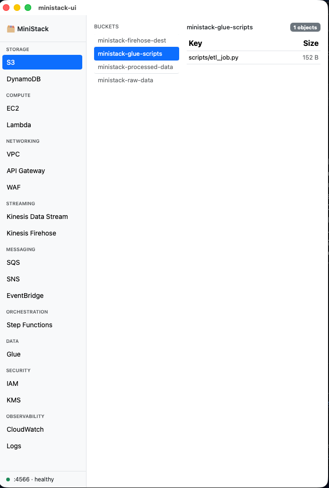

# ministack-ui

A minimal browser UI for [MiniStack](https://github.com/ministackorg/ministack) — a free LocalStack alternative for local AWS development.

This project provides two UI options:
- **For React UI (TypeScript)**: Follow instructions in [js_node/README_REACT.md](js_node/README_REACT.md)
- **For Streamlit UI (Python)**: Follow instructions in [streamlit_app/README_STREAMLIT.md](streamlit_app/README_STREAMLIT.md)
---

## Quick Start

### 1. Start MiniStack

First, ensure you have MiniStack running. You can start it with:

```bash
docker run -d -p 4566:4566 --name ministack ministack/ministack
```

### 2. Choose your UI

Select either the React or Streamlit UI and follow the instructions in their respective README files.

---

## Project Structure

```
ministack-ui/
├── js_node/                # React UI (TypeScript)
├── streamlit_app/          # Streamlit UI (Python)
├── ministack-docker/       # Docker Compose setup
└── README.md               # This file
```

---

## Contributing

Contributions are welcome! Please open an issue or submit a pull request.

---

## License

MIT


